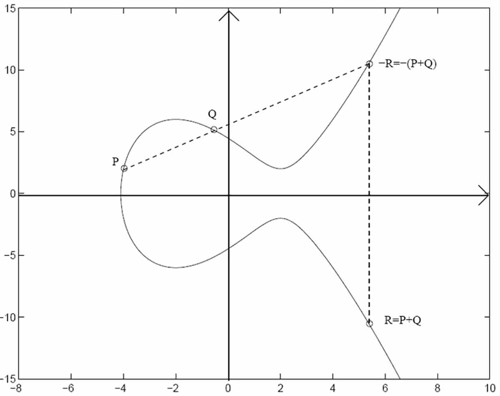

# Elliptic Curve Cryptography

[TOC]

## Define

Elliptic Curve Cryptography is a [asymmetric encryption](./Asymmetric_Encryption.md). ECC能够在较小的密钥长度下提供相当于传统RSA公钥算法更高的安全性.

Elliptic Curve是定义在有限域（通常是素数域或二元域）上的椭圆曲线。其中 $a$ 和 $b$ 是曲线参数，确保 $4a^3 + 27b^2 \neq 0$ 以避免曲线上有奇点（singular points），即曲线是光滑的。

$$
y^2 = x^3 + ax + b
$$

椭圆曲线上定义了一种称为“点加”的运算，这是ECC算法的基础。如果你有两个点 $P$ 和 $Q$ 在曲线上，那么它们的和 $P + Q$ 也在曲线上。这个运算满足以下性质：

1. **交换律**: $P + Q = Q + P$
2. **结合律**: $(P + Q) + R = P + (Q + R)$
3. **单位元**: 存在一个元素 $O$（无穷远点），对于所有的 $P$，都有 $P + O = P$
4. **逆元**: 对于每个点 $P$，都存在一个点 $-P$，使得 $P + (-P) = O$

ECC的安全性基于椭圆曲线离散对数问题（ECDLP），即给定椭圆曲线上的两个点 $P$ 和 $Q$，找到一个整数 $k$，使得 $Q = kP$ 是一个困难的问题。

## Process

### Key generation

- 选择一条椭圆曲线和定义在其上的一个生成点 $G$。
- 随机选择一个私钥 $d$（一个较小的整数）。
- 计算公钥 $Q = dG$。

### Encryption

- 发送方选取一个随机数 $k$ 并计算 $kG$，这是密文的一部分。
- 计算 $kQ$，其中 $Q$ 是接收方的公钥。
- 将明文与 $kQ$ 进行某种组合（比如XOR运算），生成密文的第二部分。

### Decryption
- 接收方使用私钥 $d$ 计算 $d(kG)$。
- 由于 $d(kG) = k(dG) = kQ$，接收方可以从密文中恢复出明文。
