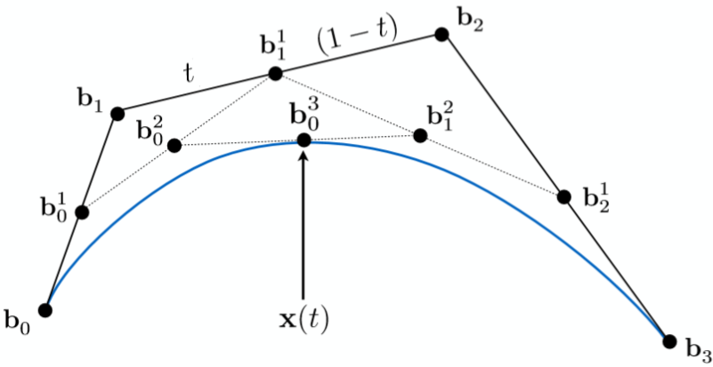
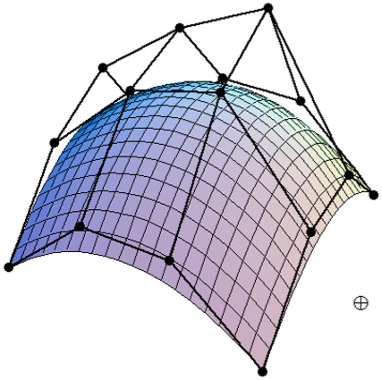

# Bézier Curve
[TOC]
## Define
For a given points $P = \{(x_i, y_i)\}_n$ 
$$
C(t) = \sum\limits_{i=0}^n P_i B_{i, n} (t) \quad, t\in [0,1]
$$
$$
B_{i, n}(t) = C_n^i t^i (1-t)^{n-i}  \tag{Bernstein}
$$

where $C(t)$ is the Bézier Curve, and $B_{i, n}(t)$ is Bernstein base function.

 

## Generate
### De Casteljau algorithm
$$
C_{0, 1, 2, ..., n}(t) = (1-t) \cdot C_{0, 1, 2, ..., n-1}(t) + t \cdot C_{1, 2, ..., n}(t)
$$

