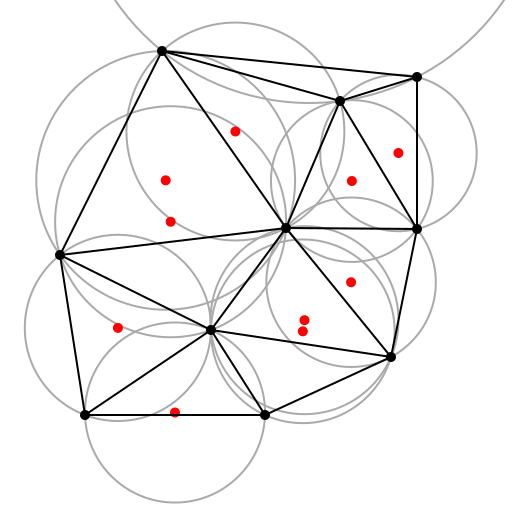
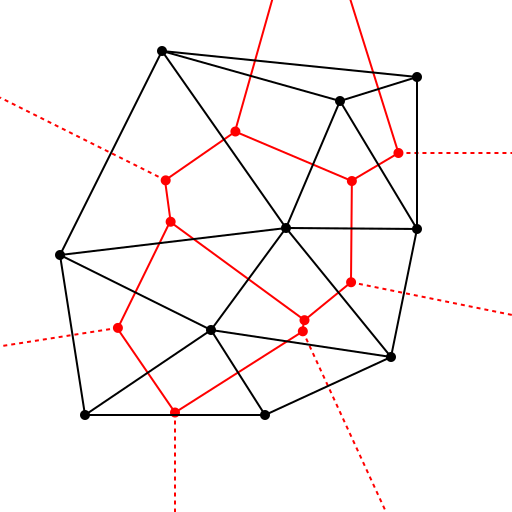
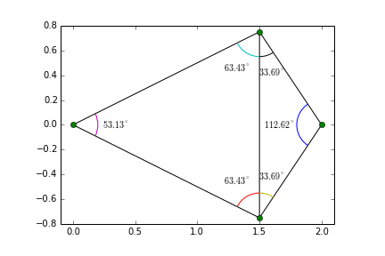

# Delaunay Triangulation

[TOC]

Delaunay triangulation is a fundamental algorithm in computational geometry, primarily used for creating a triangulation of a set of points in a plane (or in 3D) such that no point is inside the circumcircle of any triangle.

## Define

Delaunay triangulation for a given set $P$ of discrete points in a general position is a triangulation $DT(P)$ such that no point in $P$ is inside the circumcircle of any triangle in $DT(P)$. Delaunay triangulations maximize the minimum of all the angles of the triangles in the triangulation; they tend to avoid sliver triangles.

## Properties

1. **Max-min Angle Property**: Delaunay triangulation tends to avoid "skinny" triangles and, as a result, maximizes the minimum angle of all angles of the triangles.
2. **Neighbor Property**: Two points in the set are connected by an edge in the Delaunay triangulation if and only if their Voronoi polygons share an edge.
3. **Uniqueness**: If the set of points has no four points lying on the same circle, then the Delaunay triangulation is unique.

## Algorithm

Several algorithms exist to compute Delaunay triangulations:

1. **Incremental Algorithm**: Points are added one by one, and the triangulation is updated accordingly.
2. **Divide and Conquer**: Points are split into smaller sets, triangulated individually, and then merged.
3. **Sweep Algorithms**: Points are swept, usually from left to right, to form the triangulation.
4. **Flip Algorithms**: Starting with an arbitrary triangulation, non-Delaunay edges are "flipped" until the Delaunay criterion is satisfied.

