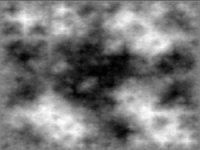

# Diamond-Square Algorithm

[TOC]

## Define

The diamond-square algorithm is a method for generating heightmaps for computer graphics. It is a slightly better algorithm than the three-dimensional implementation of the midpoint displacement algorithm, which produces two-dimensional landscapes. It is also known as the random midpoint displacement fractal, the cloud fractal or the plasma fractal, because of the plasma effect produced when applied.

The diamond-square algorithm begins with a two-dimensional square array of width and height $2^n + 1$. The four corner points of the array must first be set to initial values. The diamond and square steps are then performed alternately until all array values have been set.

- The diamond step: For each square in the array, set the midpoint of that square to be the average of the four corner points plus a random value.

- The square step: For each diamond in the array, set the midpoint of that diamond to be the average of the four corner points plus a random value.

Each random value is multiplied by a scale constant, which decreases with each iteration by a factor of 2−h, where h is a value between 0.0 and 1.0 (lower values produce rougher terrain).

During the square steps, points located on the edges of the array will have only three adjacent values set, rather than four. There are a number of ways to handle this complication - the simplest being to take the average of just the three adjacent values. Another option is to 'wrap around', taking the fourth value from the other side of the array. When used with consistent initial corner values, this method also allows generated fractals to be stitched together without discontinuities.



## Implementation

```python
import random

def diamond_square(heightmap, x1, y1, x2, y2, roughness):
    # 辅助函数，计算平均值并加入随机扰动
    def average_and_displace(values):
        average = sum(values) / len(values)
        return average + random.uniform(-roughness, roughness)

    # Diamond 步骤
    def diamond_step(x, y, size, roughness):
        average = average_and_displace([
            heightmap[x - size, y - size],
            heightmap[x + size, y - size],
            heightmap[x - size, y + size],
            heightmap[x + size, y + size]
        ])
        heightmap[x, y] = average

    # Square 步骤
    def square_step(x, y, size, roughness):
        average = average_and_displace([
            heightmap[x - size, y],
            heightmap[x + size, y],
            heightmap[x, y - size],
            heightmap[x, y + size]
        ])
        heightmap[x, y] = average

    # 初始化四个角的高度值
    heightmap[x1, y1] = random.uniform(0, 1)
    heightmap[x2, y1] = random.uniform(0, 1)
    heightmap[x1, y2] = random.uniform(0, 1)
    heightmap[x2, y2] = random.uniform(0, 1)

    size = x2 - x1
    while size > 1:
        half = size // 2

        # Diamond 步骤
        for x in range(half, x2, size):
            for y in range(half, y2, size):
                diamond_step(x, y, half, roughness)

        # Square 步骤
        for x in range(0, x2, half):
            for y in range((x + half) % size, y2, size):
                square_step(x, y, half, roughness)

        size = half

    return heightmap

# 示例使用：
size = 9  # 地形高度图的大小，要求是2^n + 1
roughness = 0.5  # 地形的崎岖度

# 初始化高度图
heightmap = [[0.0] * size for _ in range(size)]

# 运行Diamond-Square算法
diamond_square(heightmap, 0, 0, size - 1, size - 1, roughness)

# 打印生成的高度图
for row in heightmap:
    print(["{:.2f}".format(value) for value in row])

```

