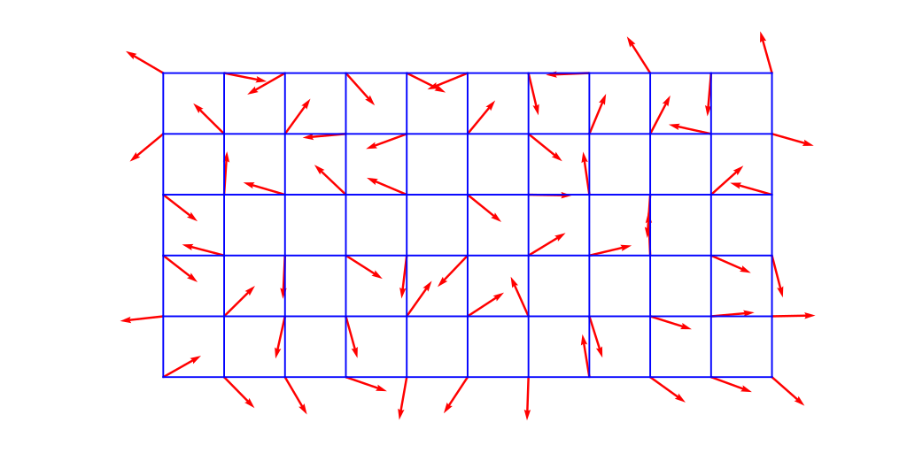

# Perlin Noise

[TOC]

## Define

Perlin noise is a type of gradient noise.


## Process

1. **Grid Initialization:** Start with a regular grid of random gradient vectors. These vectors serve as the basis for the noise generation.
2. **Gradient Dot Products:** For each point in the grid, calculate the dot product between the gradient vector and the vector from the grid point to the target point. This determines how much influence the gradient has on the noise value at that point.
3. **Interpolation:** Interpolate the dot products to obtain the final noise value. Common interpolation methods include linear, cubic, or smoothstep interpolation.
4. **Summation:** Combine the contributions from multiple grid points to compute the overall noise value at the target point.



### Implementation

```c
#include <math.h>

/* Function to linearly interpolate between a0 and a1
 * Weight w should be in the range [0.0, 1.0]
 */
float interpolate(float a0, float a1, float w) {
    /* // You may want clamping by inserting:
     * if (0.0 > w) return a0;
     * if (1.0 < w) return a1;
     */
    return (a1 - a0) * w + a0;
    /* // Use this cubic interpolation [[Smoothstep]] instead, for a smooth appearance:
     * return (a1 - a0) * (3.0 - w * 2.0) * w * w + a0;
     *
     * // Use [[Smootherstep]] for an even smoother result with a second derivative equal to zero on boundaries:
     * return (a1 - a0) * ((w * (w * 6.0 - 15.0) + 10.0) * w * w * w) + a0;
     */
}

typedef struct {
    float x, y;
} vector2;

/* Create pseudorandom direction vector
 */
vector2 randomGradient(int ix, int iy) {
    // No precomputed gradients mean this works for any number of grid coordinates
    const unsigned w = 8 * sizeof(unsigned);
    const unsigned s = w / 2; // rotation width
    unsigned a = ix, b = iy;
    a *= 3284157443; b ^= a << s | a >> w-s;
    b *= 1911520717; a ^= b << s | b >> w-s;
    a *= 2048419325;
    float random = a * (3.14159265 / ~(~0u >> 1)); // in [0, 2*Pi]
    vector2 v;
    v.x = cos(random); v.y = sin(random);
    return v;
}

// Computes the dot product of the distance and gradient vectors.
float dotGridGradient(int ix, int iy, float x, float y) {
    // Get gradient from integer coordinates
    vector2 gradient = randomGradient(ix, iy);

    // Compute the distance vector
    float dx = x - (float)ix;
    float dy = y - (float)iy;

    // Compute the dot-product
    return (dx*gradient.x + dy*gradient.y);
}

// Compute Perlin noise at coordinates x, y
float perlin(float x, float y) {
    // Determine grid cell coordinates
    int x0 = (int)floor(x);
    int x1 = x0 + 1;
    int y0 = (int)floor(y);
    int y1 = y0 + 1;

    // Determine interpolation weights
    // Could also use higher order polynomial/s-curve here
    float sx = x - (float)x0;
    float sy = y - (float)y0;

    // Interpolate between grid point gradients
    float n0, n1, ix0, ix1, value;

    n0 = dotGridGradient(x0, y0, x, y);
    n1 = dotGridGradient(x1, y0, x, y);
    ix0 = interpolate(n0, n1, sx);

    n0 = dotGridGradient(x0, y1, x, y);
    n1 = dotGridGradient(x1, y1, x, y);
    ix1 = interpolate(n0, n1, sx);

    value = interpolate(ix0, ix1, sy);
    return value; // Will return in range -1 to 1. To make it in range 0 to 1, multiply by 0.5 and add 0.5
}
```

## Property

1. **Smoothness:** Perlin noise is known for its smooth and continuous appearance. It avoids the grid-like artifacts present in simpler noise functions.
2. **Gradient Noise:** Unlike simple random noise functions, Perlin noise is a gradient noise function. It computes values based on gradients at each point, resulting in smoother transitions between values.
3. **Interpolation:** Perlin noise involves interpolation between grid points. This interpolation is what contributes to the smoothness of the generated noise.
4. **Multi-dimensional:** Perlin noise can be generated in multiple dimensions, such as 1D, 2D, 3D, and even higher dimensions. The extension to higher dimensions allows for the creation of complex and varied patterns.

## Applications

1. **Terrain Generation:** Perlin noise is frequently used to generate realistic-looking terrains by mapping noise values to elevation levels.
2. **Procedural Textures:** It is employed to create diverse and natural textures for applications like graphics rendering and game development.
3. **Animation:** Perlin noise can be used to add natural-looking randomness to animations, simulating effects like fire, clouds, or turbulent water.
4. **Procedural Generation:** In procedural content generation, Perlin noise helps create varied and interesting landscapes, structures, and patterns.