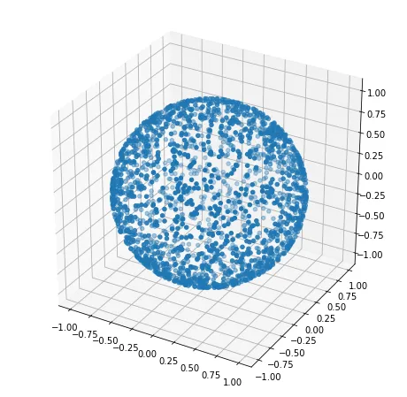

# Uniform sampling on manifolds

[TOC]

## Question

"uniform sampling on manifolds" refers to the process of generating points on a manifold in a way that ensures each region of the manifold has an approximately equal probability of being sampled. 

Let's denote the manifold as $M$, and the uniform sampling process as $P$ or $S$ (for sampling). A uniform sampling on the manifold $M$ can be defined as a probability measure $P$ or a sampling operator $S$ such that, for any measurable subset $A$ of $M$, the probability of sampling a point in $A$ is proportional to the "size" or "volume" of $A$ with respect to the intrinsic geometry of the manifold.

$$
P(A) \propto \text{Vol}_M(A)
$$

where $P(A)$ is the probability of sampling a point in $A$, and $\text{Vol}_M(A)$ is the volume of $A$ with respect to the intrinsic geometry of the manifold $M$.

## Answer

给定参数化方程，导出逆采样表达式，

For one-to-one mapping of random variables $g: x \to y$ and random vectors $g: \boldsymbol  x \to \boldsymbol  y$, the transformation between distributions is like,
$$
f_{\boldsymbol Y}(\boldsymbol y) = \frac{1}{|\det(J_g)|} f_{\boldsymbol X}(g^{-1}(\boldsymbol y))
$$

$$
f_{\vec{X}}(\vec{x})=\frac{\sqrt{\operatorname{det}\left(J_{\gamma}^{T} J_{\gamma}\right)}}{\int_{\Omega} \sqrt{\operatorname{det}\left(J_{\gamma}^{T} J_{\gamma}\right)} d x^{n}}, \vec{x} \in \Omega
$$

### Grid sampling: [Fibonacci Lattice](./Fibonacci_Lattice.md)

## Example

### Uniform sampling of spherical surfaces

$$
\begin{align*}
\xi_1, \xi_2 &\sim \text{Uniform}[0, 1]\\
\theta &= \arccos(1-2\xi_1)\\
\varphi &= 2\pi \xi_2 \\
x &= r \sin(\theta) \cos(\varphi) \\
y &= r \sin(\theta) \sin(\varphi) \\
z &= r \cos(\theta)
\end{align*}
$$

## Reference

- [流形上的均匀采样(一)——理论 - 知乎 (zhihu.com)](https://zhuanlan.zhihu.com/p/376386495)
- [流形上的均匀采样(二)——例子 - 知乎 (zhihu.com)](https://zhuanlan.zhihu.com/p/376432029)
- [球面上的均匀分布：采样与格点 - 知乎 (zhihu.com)](https://zhuanlan.zhihu.com/p/26052376)
