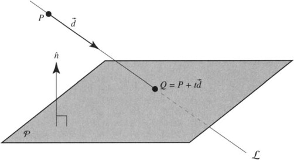

# Intersection of Ray & Surface

[TOC]

## Problem
Intersection points of Ray & Surface refer to the solution of ray and surface equation system

$$
\boldsymbol x(t) = \boldsymbol x_0 + t \hat{\boldsymbol d} \tag{ray}
$$
$$
f(\boldsymbol x) = 0 \tag{surface}
$$

For a ray and a surface, we want to connect two equations and solve $t = \text{distance}(\text{ray}, \text{surface})$.
$$
f(\boldsymbol x_0 + t \hat{\boldsymbol d}) = 0
$$

## Include

### ray & plane

#### Problem

$$
\boldsymbol a^T \boldsymbol x = b  \tag{plane}
$$

#### Solution

$$
\begin{align*}
  t &= \frac{\boldsymbol a^T \boldsymbol x_0 - b}{\boldsymbol a^T \hat{\boldsymbol d}}  \\
    &= \frac{\left(\sum\limits_{i=1}^{\dim} a_i x_{0i} \right) - b}{\sum\limits_{i=1}^{\dim} a_i d_i}  \tag{分量形式}			
\end{align*}
$$

- Proof
  $$
  \begin{align*}
  \Rightarrow\quad \boldsymbol a^T (\boldsymbol x_0 + t \hat{\boldsymbol d}) - b &= 0  \\
    t \boldsymbol a^T \hat{\boldsymbol d} + (\boldsymbol a^T \boldsymbol x_0 - b) &= 0  \\
    t &= \frac{\boldsymbol a^T \boldsymbol x_0 - b}{\boldsymbol a^T \hat{\boldsymbol d}}
  \end{align*}
  $$

### ray & triangle

#### Problem

For three vertices of a given triangle $\{\boldsymbol v_1, \boldsymbol v_2, \boldsymbol v_3\}$

#### Solution

$$
\begin{align*}
t &= \frac{(\boldsymbol x_0 - \boldsymbol v_1) × \boldsymbol e_1·\boldsymbol e_2}{\hat{\boldsymbol d} × \boldsymbol e_2·\boldsymbol e_1}  \\
u &= \frac{\hat{\boldsymbol d} × \boldsymbol e_2· (\boldsymbol x_0 - \boldsymbol v_1)}{\hat{\boldsymbol d} × \boldsymbol e_2·\boldsymbol e_1}  \\
v &= \frac{(\boldsymbol x_0 - \boldsymbol v_1) × \boldsymbol e_1· \hat{\boldsymbol d}}{\hat{\boldsymbol d} × \boldsymbol e_2·\boldsymbol e_1}  \\
\boldsymbol e_1 &= \boldsymbol v_2 - \boldsymbol v_1  \\
\boldsymbol e_2 &= \boldsymbol v_3 - \boldsymbol v_1
\end{align*}
$$

有交点条件: $u ≥ 0, v ≥ 0, u + v ≤ 1$

- Proof
  $$
  \begin{align*}
    \boldsymbol x_0 + t \hat{\boldsymbol d} &= (1 - u - v) \boldsymbol v_1 + u \boldsymbol v_2 + v \boldsymbol v_3  \\
    \Rightarrow\quad \boldsymbol x_0 - \boldsymbol v_1 &=\left(\begin{matrix}-\hat{\boldsymbol d} & \boldsymbol v_2 - \boldsymbol v_1 & \boldsymbol v_3-\boldsymbol v_1 \end{matrix}\right) \left(\begin{matrix}t \\ u \\ v \end{matrix}\right)   \\
    &= \left(\begin{matrix}-\hat{\boldsymbol d} & \boldsymbol e_1 & \boldsymbol e_2 \end{matrix}\right) \left(\begin{matrix}t \\ u \\ v \end{matrix}\right)  \tag{$\boldsymbol e_1 = \boldsymbol v_2 - \boldsymbol v_1, \boldsymbol e_2 = \boldsymbol v_3 - \boldsymbol v_1$}
  \end{align*}
  $$

  $$
  \begin{align*}
    t &= \frac{\left|\begin{matrix}  (\boldsymbol x_0 - \boldsymbol v_1) & \boldsymbol e_1 & \boldsymbol e_2 \end{matrix}\right|}{\left|\begin{matrix} -\hat{\boldsymbol d} & \boldsymbol e_1 & \boldsymbol e_2 \end{matrix}\right|}  \\
    u &= \frac{\left|\begin{matrix} -\hat{\boldsymbol d} &  (\boldsymbol x_0 - \boldsymbol v_1) & \boldsymbol e_2 \end{matrix}\right|}{\left|\begin{matrix} -\hat{\boldsymbol d} & \boldsymbol e_1 & \boldsymbol e_2 \end{matrix}\right|}  \\
    v &= \frac{\left|\begin{matrix} -\hat{\boldsymbol d} & \boldsymbol e_1 & (\boldsymbol x_0 - \boldsymbol v_1) \end{matrix}\right|}{\left|\begin{matrix} -\hat{\boldsymbol d} & \boldsymbol e_1 & \boldsymbol e_2 \end{matrix}\right|}
  \end{align*}
  $$

  $$
  \begin{align*}
    \left|\begin{matrix} \boldsymbol a & \boldsymbol b & \boldsymbol c \end{matrix}\right| &= \boldsymbol a × \boldsymbol b · \boldsymbol c   \\
    &= -\boldsymbol a × \boldsymbol c · \boldsymbol b  \tag{混合积公式} \\
    t &= \frac{(\boldsymbol x_0 - \boldsymbol v_1) × \boldsymbol e_1·\boldsymbol e_2}{\hat{\boldsymbol d} × \boldsymbol e_2·\boldsymbol e_1}  \\
    u &= \frac{\hat{\boldsymbol d} × \boldsymbol e_2· (\boldsymbol x_0 - \boldsymbol v_1)}{\hat{\boldsymbol d} × \boldsymbol e_2·\boldsymbol e_1}  \\
    v &= \frac{(\boldsymbol x_0 - \boldsymbol v_1) × \boldsymbol e_1· \hat{\boldsymbol d}}{\hat{\boldsymbol d} × \boldsymbol e_2·\boldsymbol e_1}
  \end{align*}
  $$

### ray & quadric surface

#### Problem

$$
f(\boldsymbol x) = \boldsymbol x^T \boldsymbol A \boldsymbol x + \boldsymbol b \boldsymbol x + \boldsymbol c \tag{quadric surface}
$$

$$
f(\boldsymbol x_0 + t \hat{\boldsymbol d}) = (\boldsymbol x_0 + t \hat{\boldsymbol d})^T \boldsymbol A (\boldsymbol x_0 + t \hat{\boldsymbol d}) + \boldsymbol b (\boldsymbol x_0 + t \hat{\boldsymbol d}) + \boldsymbol c = 0
$$

### ray & surface of sphere

#### Problem

$$
||\boldsymbol x - \boldsymbol c||_2 - R = 0 \tag{surface of sphere}
$$

#### Solution

$$
\begin{align*}
  t &= \frac{-b ± \sqrt{Δ}}{2a}  \\
  Δ &= b^2 - 4 a c  \\
    &= \left(2 \hat{\boldsymbol d}^T (\boldsymbol x_0 - \boldsymbol c) \right)^2 - 4 \left(\hat{\boldsymbol d}^T \hat{\boldsymbol d} \right) \left((\boldsymbol x_0 - \boldsymbol c)^T (\boldsymbol x_0 - \boldsymbol c) - R^2 \right)  \\
    &= 4 \left(\sum_{i=1}^{\dim} d_i (x_{0i} - c_i) \right)^2 - 4 \left(\sum_{i=1}^{\dim} d_i^2\right) \left(\left(\sum_{i=1}^{\dim} (x_{0i} - c_i)^2 \right) - R^2 \right)  \tag{分量形式}  \\
\end{align*}
$$

若$Δ≥0$有交点; 若$Δ<0$无交点.

- Proof
  $$
  \begin{align*}
    \Rightarrow\quad (\boldsymbol x - \boldsymbol c)^T (\boldsymbol x - \boldsymbol c) - R^2 &= 0  \\
    \Rightarrow\quad (\boldsymbol x_0 + t \hat{\boldsymbol d} - \boldsymbol c)^T (\boldsymbol x_0 + t \hat{\boldsymbol d} - \boldsymbol c) - R^2 &= 0  \tag{相交，代入}  \\
    \Rightarrow\quad t^2 (\hat{\boldsymbol d}^T \hat{\boldsymbol d}) + t (2 \hat{\boldsymbol d}^T (\boldsymbol x_0 - \boldsymbol c)) + ((\boldsymbol x_0 - \boldsymbol c)^T (\boldsymbol x_0 - \boldsymbol c) - R^2) &= 0
  \end{align*}
  $$

  $$
  \begin{align*}
    Δ &= b^2 - 4 a c  \\
      &= (2 \hat{\boldsymbol d}^T (\boldsymbol x_0 - \boldsymbol c))^2 - 4 (\hat{\boldsymbol d}^T \hat{\boldsymbol d}) ((\boldsymbol x_0 - \boldsymbol c)^T (\boldsymbol x_0 - \boldsymbol c) - R^2)
  \end{align*}
  $$
  
  若$Δ≥0$有交点; 若$Δ<0$无交点.
  
  $$
  t = \frac{-b ± \sqrt{Δ}}{2a}
  $$

### ray & surface of ellipsoid

#### Problem

$$
(\boldsymbol x - \boldsymbol c)^T \boldsymbol P^{-1} (\boldsymbol x - \boldsymbol c) = 1 \tag{surface of ellipsoid}
$$

#### Solution

$$
\begin{align*}
t &= \frac{-b ± \sqrt{Δ}}{2a}  \\
Δ &= b^2 - 4 a c  \\
&= (2 \hat{\boldsymbol d}^T \boldsymbol P^{-1} (\boldsymbol x_0 - \boldsymbol c))^2 - 4 (\hat{\boldsymbol d}^T \boldsymbol P^{-1} \hat{\boldsymbol d}) ((\boldsymbol x_0 - \boldsymbol c)^T \boldsymbol P^{-1} (\boldsymbol x_0 - \boldsymbol c) - 1)
\end{align*}
$$

若$Δ≥0$有交点; 若$Δ<0$无交点.

- Proof
$$
\begin{align*}
\Rightarrow\quad (t \hat{\boldsymbol d} + (\boldsymbol x_0 - \boldsymbol c))^T \boldsymbol P^{-1} (t \hat{\boldsymbol d} + (\boldsymbol x_0 - \boldsymbol c)) - 1 &= 0  \\
t^2 (\hat{\boldsymbol d}^T \boldsymbol P^{-1} \hat{\boldsymbol d}) + t (2 \hat{\boldsymbol d}^T \boldsymbol P^{-1} (\boldsymbol x_0 - \boldsymbol c)) + ((\boldsymbol x_0 - \boldsymbol c)^T \boldsymbol P^{-1} (\boldsymbol x_0 - \boldsymbol c) - 1) &= 0
\end{align*}
$$

$$
\begin{align*}
Δ &= b^2 - 4 a c  \\
&= (2 \hat{\boldsymbol d}^T \boldsymbol P^{-1} (\boldsymbol x_0 - \boldsymbol c))^2 - 4 (\hat{\boldsymbol d}^T \boldsymbol P^{-1} \hat{\boldsymbol d}) ((\boldsymbol x_0 - \boldsymbol c)^T \boldsymbol P^{-1} (\boldsymbol x_0 - \boldsymbol c) - 1)
\end{align*}
$$
若$Δ≥0$有交点; 若$Δ<0$无交点.
$$
t = \frac{-b ± \sqrt{Δ}}{2a}
$$

### ray & surface of Cuboid

### ray & surface of fourth order

### ray & surface of Ring

$$
(R^2 - r^2 + \boldsymbol x^T \boldsymbol x)^2 - 4 R^2 (\boldsymbol x^T \boldsymbol x - x_i^2) = 0  \\
f = 0  \\
(R^2 - r^2 + (\boldsymbol x_0 + t \hat{\boldsymbol d})^T (\boldsymbol x_0 + t \hat{\boldsymbol d}))^2 - 4 R^2 ((\boldsymbol x_0 + t \hat{\boldsymbol d})^T (\boldsymbol x_0 + t \hat{\boldsymbol d}) - (\boldsymbol x_0 + t \hat{\boldsymbol d})_i^2) = 0  \\
$$

