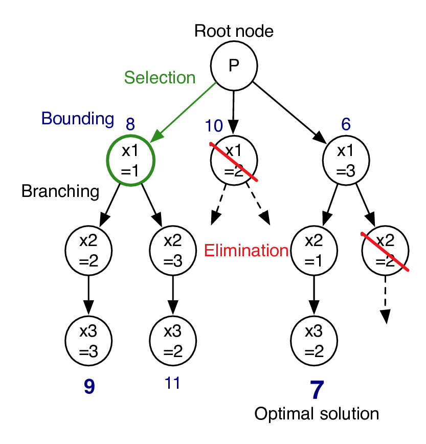

# $Integer\ Programming\ \&\ Mixed\ Integer\ Programming$

[TOC]

## Define  
Integer Programming: A class of problems in which variables can only be integer.

Mixed Integer Programming: A class of problems in which variables can be integer.

## Include

### 0-1 Programming

- Define
  A class of problems in which variables can only be 0 or 1.

## Solve

### Branch and Bound Method

1. Using a heuristic, find a solution $x_h$ to the optimization problem. Store its value, $B = f(x_h)$. (If no heuristic is available, set $B$ to infinity.) $B$ will denote the best solution found so far, and will be used as an upper bound on candidate solutions. 
2. Initialize a queue to hold a partial solution with none of the variables of the problem assigned. 
3. Loop until the queue is empty: 	
   1. Take a node $N$ off the queue.  
   2. If $N$ represents a single candidate solution x and $f(x) < B$, then x is the best solution so far. Record it and set $B ← f(x)$.  
   3. Else, branch on $N$ to produce new nodes $N_i$. For each of these: 
      1. If $bound(N_i) > B$, do nothing; since the lower bound on this node is greater than the upper bound of the problem, it will never lead to the optimal solution, and can be discarded. 	 	
      2. Else, store $N_i$ on the queue.
