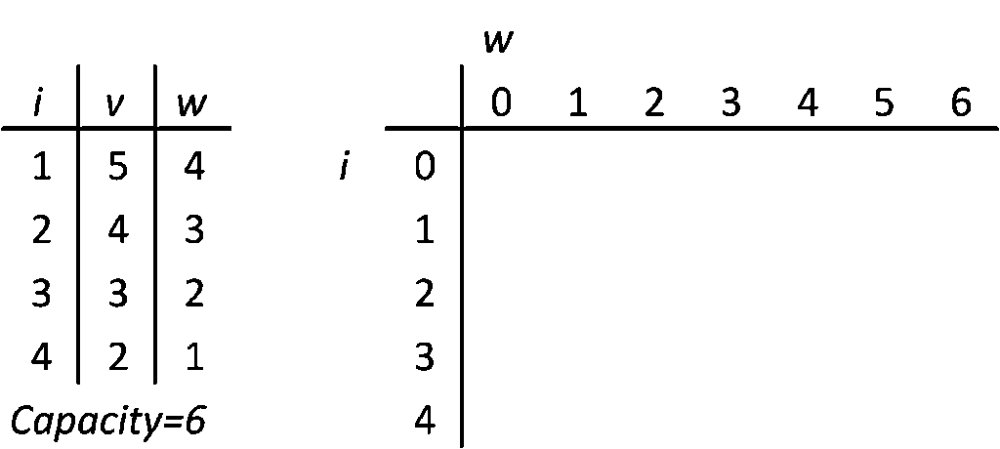

# Knapsack Problem

[TOC]

## Define
$$
\begin{align*}
    \max_{\boldsymbol I} \quad& \boldsymbol I^T \boldsymbol v  \tag{Knapsack Problem}\\
    s.t. \quad& c - \boldsymbol I^T \boldsymbol w \ge 0  \\
\end{align*}
$$
For a set of items, each with a weight and a value $(w, v)$, determine which items to include in the collection so that the total weight is less than or qual to a given limit $c$ and the total value is as latge as possible.

There are several types of Knapsack Problems based on the type of $\boldsymbol I$ as follows,
- 0/1 Knapsack Problem, is a Knapsack Problem with that the number of available copies of each item is restricted to 0 or 1. ([0-1 Programming](./Integer_Programming.md))
  $$
  \begin{align*}
      \max_{\boldsymbol I \in \{0, 1\}^n} \quad& \boldsymbol I^T \boldsymbol v  \tag{0/1 Knapsack}\\
      s.t. \quad& c - \boldsymbol I^T \boldsymbol w \ge 0  \\
  \end{align*}
  $$

- Unbounded Knapsack Problem, is a Knapsack Problem without any item quantity limit.
  $$
  \begin{align*}
      \max_{\boldsymbol I \in \mathbb Z^n} \quad& \boldsymbol I^T \boldsymbol v  \tag{Unbounded Knapsack}\\
      s.t. \quad& c - \boldsymbol I^T \boldsymbol w \ge 0  \\
  \end{align*}
  $$

- Multiple Knapsack Problem, is a Knapsack Problem with given item quantity limit $\boldsymbol k$.
  $$
  \begin{align*}
      \max_{\boldsymbol I \in \mathbb Z^n} \quad& \boldsymbol I^T \boldsymbol v  \tag{Multiple Knapsack}\\
      s.t. \quad& c - \boldsymbol I^T \boldsymbol w \ge 0  \\
      & \boldsymbol I \preceq \boldsymbol k
  \end{align*}
  $$

- Fractional Knapsack Problem, is a Knapsack Problem that allows items to be divided into parts of any size and placed in a backpack.
  $$
  \begin{align*}
      \max_{\boldsymbol I \in [0, 1]^n} \quad& \boldsymbol I^T \boldsymbol v  \tag{Fractional Knapsack}\\
      s.t. \quad& c - \boldsymbol I^T \boldsymbol w \ge 0  \\
  \end{align*}
  $$

## Property  

- The original problem can convert to a new form through the barrier function $F(\cdot)$,
  $$\max_{\boldsymbol I \in \{0, 1\}^n} \quad \boldsymbol I^T \boldsymbol v + F(c - \boldsymbol I^T \boldsymbol w)$$  
- For the first $i$ items, if $\boldsymbol I_{a, 1:i}^T \boldsymbol v_{1:i} > \boldsymbol I_{b, 1:i}^T \boldsymbol v_{1:i}$ with a same sum of weight, then the search branch of the $I_{b, 1:i}$ can be pruned and terminated. 

## Solving

**Dynamic Programming**. For each item, there are only two choices: include or exclude, and we just need to select the choice with maximum value $f(i, c')$ for parameters of the current item and remaining capacity $i, c'$.
$$
\begin{align*}
  f_{i, j} &= -\infty \quad; j < 0  \\
  f_{0, j} &= 0 \tag{initial}  \\
  f_{i, 0} &= 0 
\end{align*}
$$

$$
f_{i, j} = \max(f_{i-1, j}, f_{i-1, j-w_i} + v_i)  \tag{0/1 Knapsack}
$$
$$
\begin{align*}
  f_{i, j} 
  &= \max_{k=0}^{\infty} (f_{i-1, j-k w_i} + k v_i)  \tag{Unbounded Knapsack}\\
  &= \max(f_{i-1,j}, f_{i,j-w_i} + v_i)
\end{align*}
$$

$$
f_{i, j} = \max_{k=0}^{k_i} (f_{i-1, j-k w_i} + k v_i)  \tag{Multiple Knapsack}
$$

