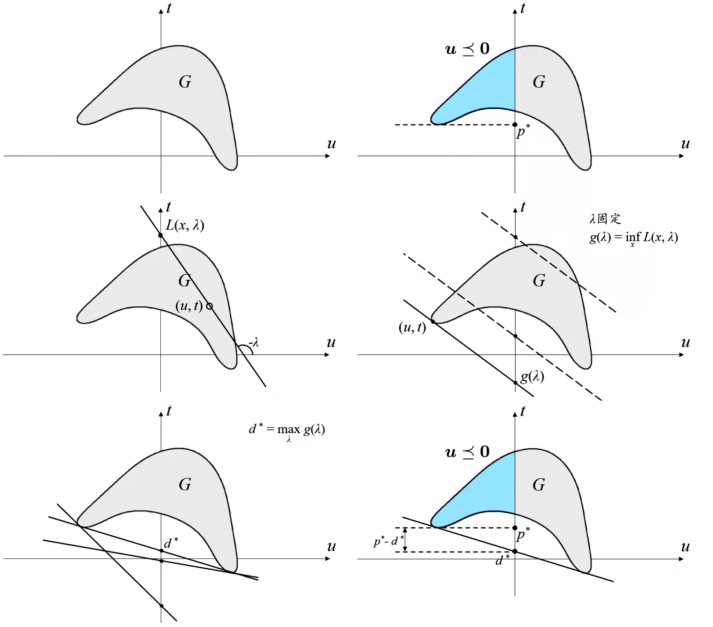

# $Optimization\ Problem$

[TOC]
## Define

$$
\begin{align*}
  \min \quad & f_0(x)  \tag{Objective Function}\\
  s.t. \quad & f_i(x) ≤ 0  \tag{Inequality Constraint}\\
        & h_i(x) = 0  \tag{Equality Constraint}
\end{align*}
$$

$$
p^*= \inf \{f_{0}(x) | f_i(x) ≤ 0, h_i(x) = 0 \}  \tag{Optimal solution}
$$

Optimization Problem aims to find the minimal values called optimal solution $p^*$ of objective function $f_0(\cdot)$, subject to the constraints $f_i(\cdot), h_i(\cdot)$.

## Include

### Feasibility Problem

- Define
  $$
  \begin{align*}
    \min_x \quad & const. \\
    s.t. \quad & f_i(x) ≤ 0  \\
          & h_i(x) = 0
  \end{align*}
  $$

  If the objective function is equal to a constant, the optimal solution is 0 (Feasible set is not empty) or $\infty$ (Feasible set is empty).

### [Convex Optimization Problem](./Convex_Optimization_Problem.md)

### [Integer Programming & Mixed Integer Programming](./Integer_Programming.md)

### Nonconvex Optimization Problem

## Property

### Lagrange Function  

- Define
  $$
  L(\boldsymbol x, \boldsymbol λ, \boldsymbol ν) = f_0(\boldsymbol x) + \sum_i λ_i f_i(\boldsymbol x) + \sum_i ν_i h_i(\boldsymbol x)
  $$
  - $f_0, f_i, h_i$ 是标准形式优化问题的目标函数、约束函数.

### Lagrange Dual function, Dual Problem

- Define  
  $$
  \begin{align*}
    g(\boldsymbol λ, \boldsymbol ν) &= \inf_{\boldsymbol x \in D}\ L(\boldsymbol x, \boldsymbol λ, \boldsymbol ν)  \\
      &= \inf_{\boldsymbol x \in D}\ f_0(\boldsymbol x) + \sum_i λ_i f_i(\boldsymbol x) + \sum_i ν_i h_i(\boldsymbol x)
  \end{align*}
  $$
  
  Dual Problem
  $$
  \begin{align*}
    \max_{\boldsymbol λ, \boldsymbol ν} \quad & g(\boldsymbol λ, \boldsymbol ν)  \\
    s.t. \quad & \boldsymbol λ ⪰ 0
  \end{align*}
  $$
  
  Symbol:
  $L: \mathbb  R^n × \mathbb  R^m × \mathbb  R^p \to \mathbb  R,\quad  dom\ L: D × \mathbb  R^m × \mathbb  R^p$
  
- Property  
  - 即使原问题非凸, Dual function仍然是凹函数.
  - $g(\boldsymbol λ, \boldsymbol ν) ≤ p^*$  
    Dual function构成原问题的下界.   
    Dual function是一族关于$(\boldsymbol λ, \boldsymbol ν)$的仿射函数的逐点下确界.  
    - Proof  
      设$\tilde{\boldsymbol x}$是原问题的一个可行点,  
      $$
      \begin{align*}
        \Rightarrow λ_i f_i(\tilde{\boldsymbol x}) ≤ 0  \tag{$\boldsymbol λ ⪰ 0, f(\tilde{\boldsymbol x}) ≤ 0$}  \\
          ν_i h_i(\tilde{\boldsymbol x}) = 0  \tag{$h(\tilde{\boldsymbol x}) = 0$}  \\
        \Rightarrow \sum_i λ_i f_i(\tilde{\boldsymbol x}) + \sum_i ν_i h_i(\tilde{\boldsymbol x}) ≤ 0
      \end{align*}
      $$

      $$
      \begin{align*}
        \Rightarrow & L(\tilde{\boldsymbol x}, \boldsymbol λ, \boldsymbol ν) = f_0(\tilde{\boldsymbol x}) + \sum_i λ_i f_i(\tilde{\boldsymbol x}) + \sum_i ν_i h_i(\tilde{\boldsymbol x}) ≤ f_0(\tilde{\boldsymbol x})  \\
        \Rightarrow & g(\boldsymbol λ, \boldsymbol ν) ≤ p^*
      \end{align*}
      $$

  - Duality  
    Weak Duality: $p^* ≥ d^*$ 一定存在
    Strong Duality: $p^* = d^*$

  - Slate 准则
  * [Karush-Kuhn-Tucker Optimality Conditions](./Karush_Kuhn_Tucker_Conditions.md)
- Note -- Lagrange 对偶问题理解 (Boyd,凸优化,233页)  
  
  
  
  - 优化问题  
    目标函数不一定是凸函数  
    $$
    \begin{align*}
      \min \quad & f_0(\boldsymbol x)  \tag{目标函数}  \\
      s.t. \quad & f_i(\boldsymbol x) ≤ 0  \quad  i = 1,...,m  \tag{不等式约束}  \\
        & h_i(\boldsymbol x) = 0  \quad  i = 1,...,p  \tag{等式约束}
    \end{align*}
    $$
  
  - 可行集
    $$
    \begin{align*}
      G &= \{(f_1(x), ... , f_2(x), h_1(x), ... , h_2(x), f_0(x)) \in \mathbb  R^m × \mathbb  R^n × \mathbb  R \ |\  x \in D\}  \\
        &= \{(\boldsymbol u, \boldsymbol v, t) \ |\  u_i = f_i(x), v_i = h_i(x), t = f_0(x), x \in D\}
    \end{align*}
    $$
    图1. 以只有一个不等式约束为例, 可行集$G$区域如图所示.
  
  - 原问题
    $$
    \begin{align*}
      p^* = \inf\{t \ |\  (\boldsymbol u, \boldsymbol v, t) \in G, \boldsymbol u ⪯ \boldsymbol 0, \boldsymbol v = \boldsymbol 0\}
    \end{align*}
    $$
    图2. 因为$\boldsymbol u ⪯ \boldsymbol 0$, 所以原问题$f_0(\boldsymbol x)$ 最优值如图中$p^*$所示.
  
  - Lagrange 函数
    $$
    \begin{align*}
      L(\boldsymbol x, \boldsymbol λ, \boldsymbol ν) &= (\boldsymbol λ, \boldsymbol ν, 1)^T (\boldsymbol u, \boldsymbol v, t)  \tag{$(\boldsymbol u, \boldsymbol v, t) \in G, \boldsymbol λ ⪰ 0$}  \\
        &= \sum_i λ_i u_i + \sum_i ν_i v_i + t
    \end{align*}
    $$
    图3. 对于可行集$G$中任意一点$(u, t) \in G$, Lagrange 函数的值是经过该点$(u, t)$以斜率$k=-λ$的直线, 与纵坐标$t$的交点值. 同时, 因为$λ ⪰ 0$, 所以直线只能斜向下or水平.
  
  - Dual Function
    $$
    \begin{align*}
      g(\boldsymbol λ, \boldsymbol ν) &= \inf_{\boldsymbol x}\ L(\boldsymbol x, \boldsymbol λ, \boldsymbol ν)  \\
        &= \inf_{\boldsymbol x}((\boldsymbol λ, \boldsymbol ν, 1)^T (\boldsymbol u, \boldsymbol v, t))
    \end{align*}
    $$
    图4. Dual function$g(λ_0)$是在直线斜率$λ = λ_0$固定的情况下, Lagrange 函数的最小值, 即点$(u, t)$在可行集$G$内时, 直线与纵坐标$t$ 最低的交点的值. 同时, 使得直线的可行集$G$下半部分的斜向下的切线.
  
  - 对偶问题
    $$
    d^* = \max_{\boldsymbol λ, \boldsymbol ν} \quad  g(\boldsymbol λ, \boldsymbol ν)
    $$
    图5. 对偶问题是"最大的最小值", Dual function的最大值, $\max_{\boldsymbol λ, \boldsymbol ν} \inf_{\boldsymbol x}\ L(\boldsymbol x, \boldsymbol λ, \boldsymbol ν)$.  
    即, 找到可行集$G$下半部分的一条斜向下的切线, 使其与纵坐标的交点的值最大. 如图中$d^*$所示.
  
  - 强对偶性判定  
    弱对偶性: 一定有$p^* ≥ d^*$    
    强对偶性: $p^* = d^*$  
    图6. 图中显示了该问题的对偶性强弱, 因为最优对偶间隙$p^* - d^* > 0$, 故该问题不满足强对偶性.  

