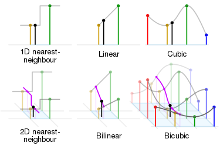
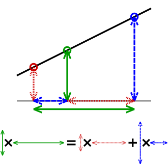

# $Interpolation$

[TOC]

## Define

Interpolation is a type of estimation, a method of constructing (finding) new data points based on the range of a discrete set of known data points.

## Include

### Linear interpolation

linear interpolation is a method of curve fitting using linear polynomials to construct new data points within the range of a discrete set of known data points.
$$
\begin{aligned}
y & =y_{0}+\left(x-x_{0}\right) \frac{y_{1}-y_{0}}{x_{1}-x_{0}} \\
& =\frac{y_{0}\left(x_{1}-x_{0}\right)}{x_{1}-x_{0}}+\frac{y_{1}\left(x-x_{0}\right)-y_{0}\left(x-x_{0}\right)}{x_{1}-x_{0}} \\
& =\frac{y_{1} x-y_{1} x_{0}-y_{0} x+y_{0} x_{0}+y_{0} x_{1}-y_{0} x_{0}}{x_{1}-x_{0}} \\
& =\frac{y_{0}\left(x_{1}-x\right)+y_{1}\left(x-x_{0}\right)}{x_{1}-x_{0}}
\end{aligned}
$$

### Polynomial interpolation

polynomial interpolation is the interpolation of a given bivariate data set by the polynomial of lowest possible degree that passes through the points of the dataset.
$$
\begin{aligned}
p(x) = &\frac{\left(x-x_{1}\right)\left(x-x_{2}\right) \cdots\left(x-x_{n}\right)}{\left(x_{0}-x_{1}\right)\left(x_{0}-x_{2}\right) \cdots\left(x_{0}-x_{n}\right)} y_{0} +\\
&\frac{\left(x-x_{0}\right)\left(x-x_{2}\right) \cdots\left(x-x_{n}\right)}{\left(x_{1}-x_{0}\right)\left(x_{1}-x_{2}\right) \cdots\left(x_{1}-x_{n}\right)} y_{1} +\\
& \cdots +\\
& \frac{\left(x-x_{0}\right)\left(x-x_{1}\right) \cdots\left(x-x_{n-1}\right)}{\left(x_{n}-x_{0}\right)\left(x_{n}-x_{1}\right) \cdots\left(x_{n}-x_{n-1}\right)} y_{n} \\
=& \sum_{i=0}^{n}\left(\prod_{\substack{0 \leq j \leq n \\
j \neq i}} \frac{x-x_{j}}{x_{i}-x_{j}}\right) y_{i}  \\
=&\sum_{i=0}^{n} \frac{p(x)}{p^{\prime}\left(x_{i}\right)\left(x-x_{i}\right)} y_{i}
\end{aligned}
$$

### Spline interpolation

Spline interpolation is a form of interpolation where the interpolant is a special type of piecewise polynomial called a spline.

#### B-Spline Interpolation

