# Acid Ions

[TOC]

# $\ce{OH−}$

$\ce{OH−}$ consists of an oxygen and hydrogen atom held together by a single covalent bond, and carries a negative electric charge.

## $\ce{NaOH}$

$\ce{NaOH}$ is a white solid ionic compound consisting of sodium cations Na+ and hydroxide anions OH−.

## $\ce{Al(OH)3}$

## $\ce{KOH}$

# $\ce{CN^-}$
## $\ce{HCN}$

$$
\ce{H-C#N}
$$

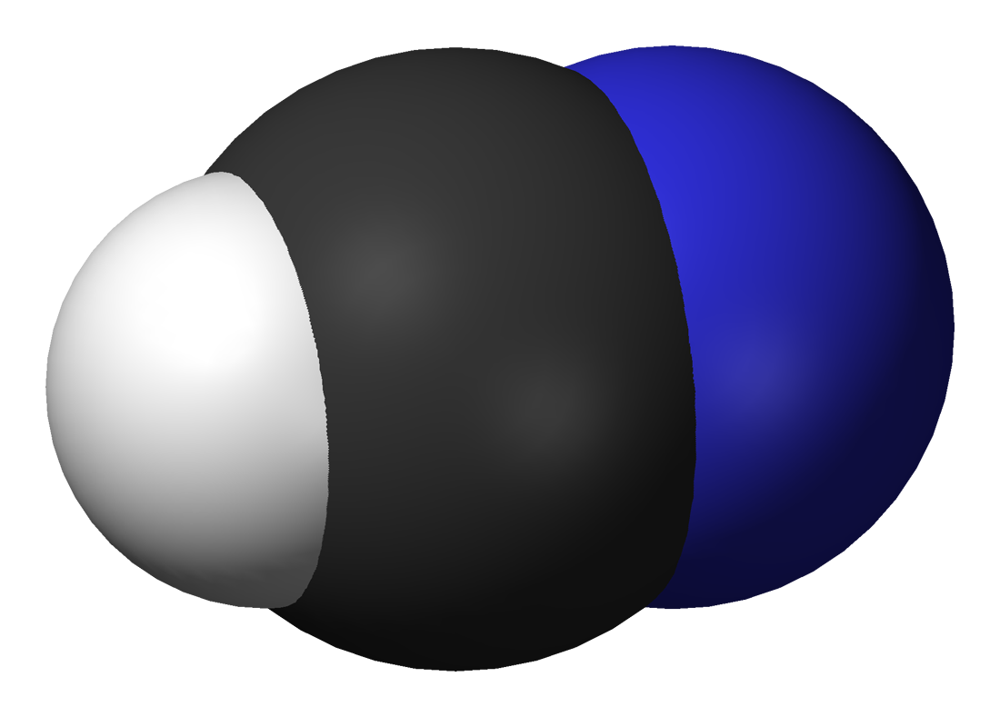

## $\ce{KCN}$

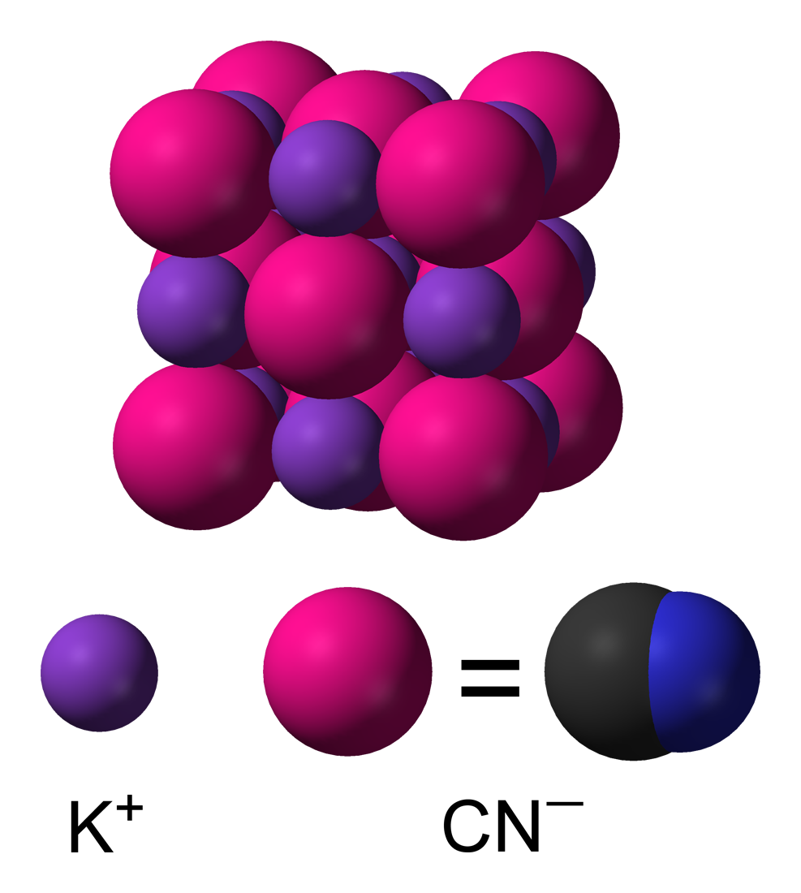

# $\ce{CO^{2−}3}$

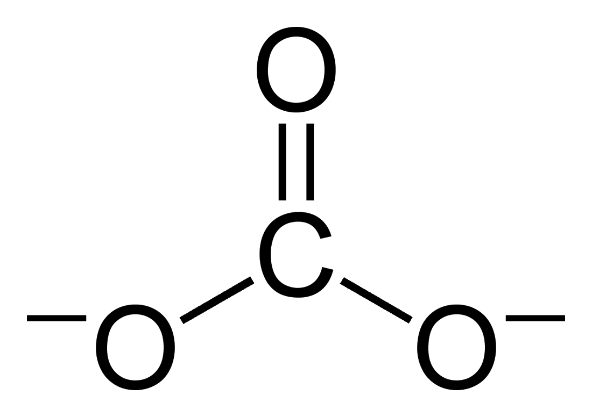
$$
\ce{CO^{2−}3 + 2 H2O <=> HCO^{−}3 + H2O + OH− <=> H2CO3 + 2 OH−}\\
\ce{H2CO3 + 2 H2O <=> HCO^{−}3 + H3O+ + H2O <=> CO^{2−}3 + 2 H3O+}
$$
## $\ce{H2CO3}$

## $\ce{CaCO3}$

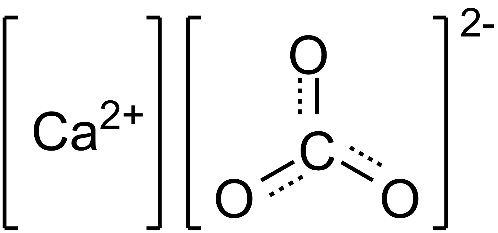

## $\ce{Na2CO3}$

$$
\ce{Na2CO3 + CO2 + H2O -> 2NaHCO3}
$$

$$
\ce{Na2CO3 + SO2 + H2O -> NaHCO3 + NaHSO3}
$$

# $\ce{HCO^{−}3}$

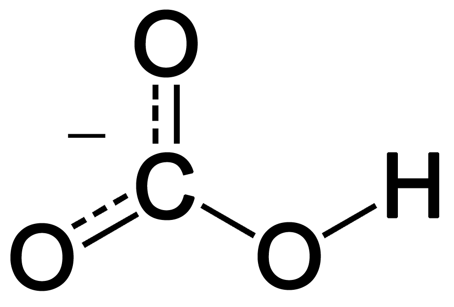

## $\ce{NaHCO3}$

# $\ce{NO^-2}$

## $\ce{HNO2}$

# $\ce{NO^-3}$

## $\ce{HNO3}$

## $\ce{KNO3}$

# $\ce{SO^{2-}4}$

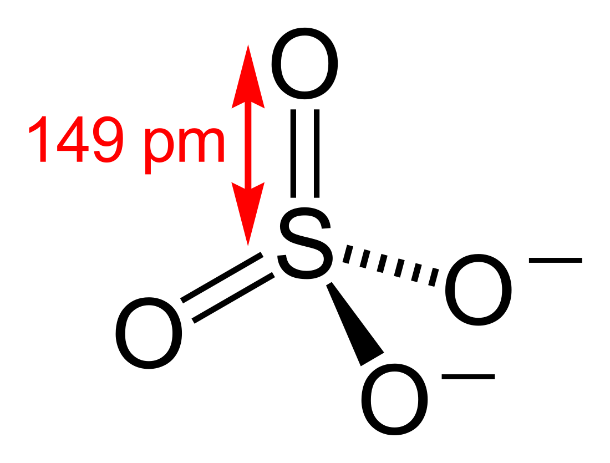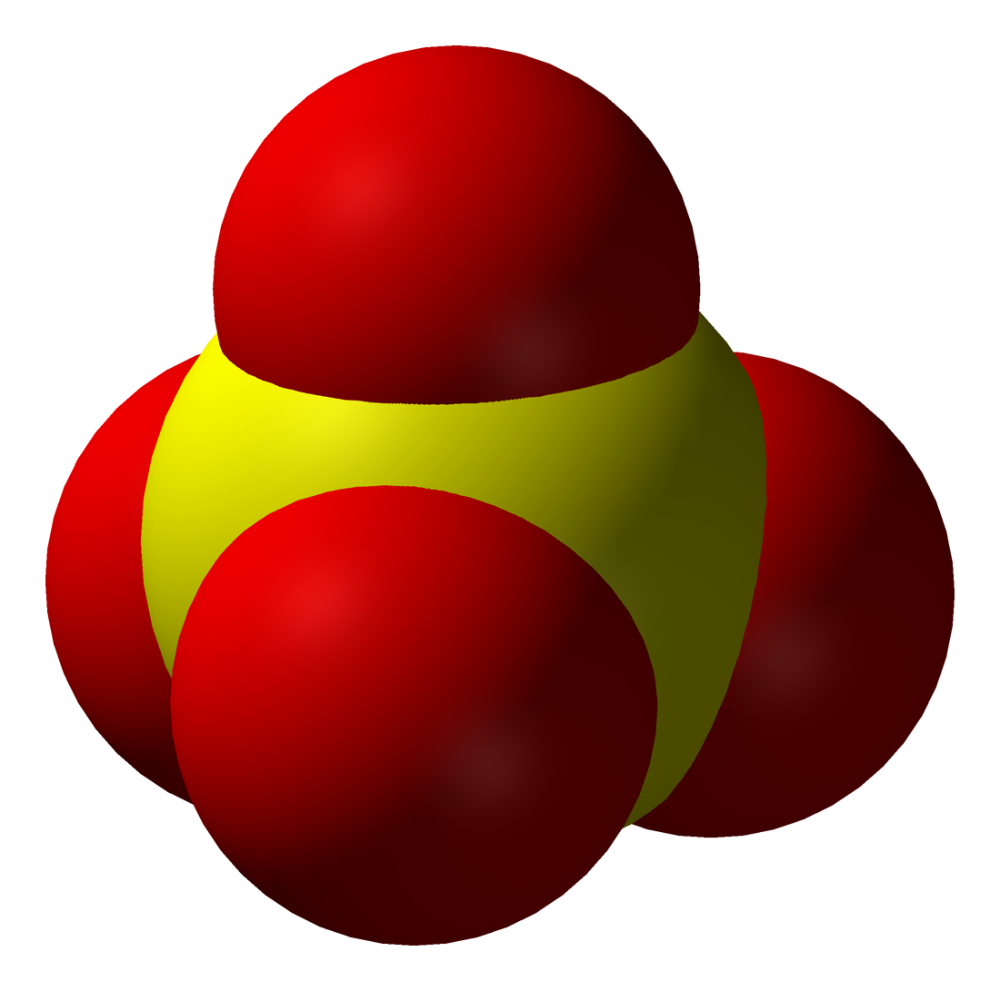

## $\ce{H2SO4}$

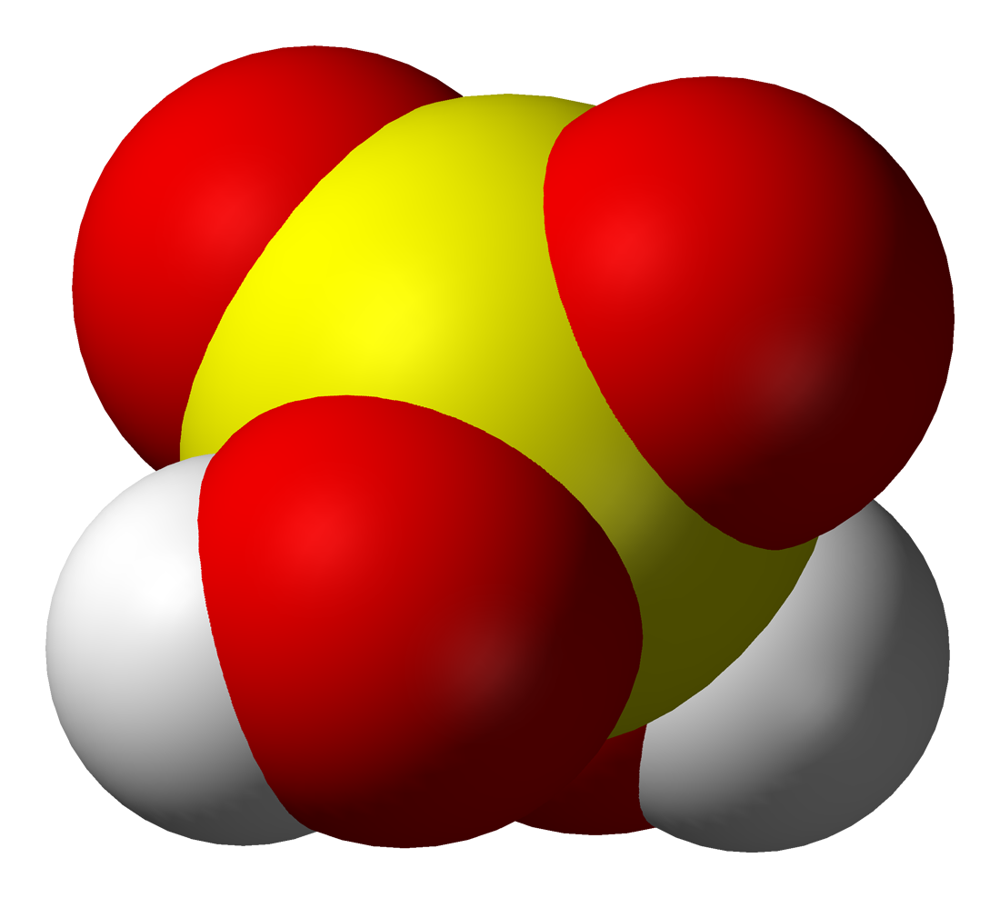
$$
\displaystyle {\underset {\text{sucrose}}{{\ce {C12H22O11}}}}\longrightarrow {\underset {{\text{black}} \atop {\text{graphitic foam}}}{{\ce {12 C}}}}+{\ce {11 H2O_{(g,l)}}}
$$

## $\ce{KAl(SO4)2}$

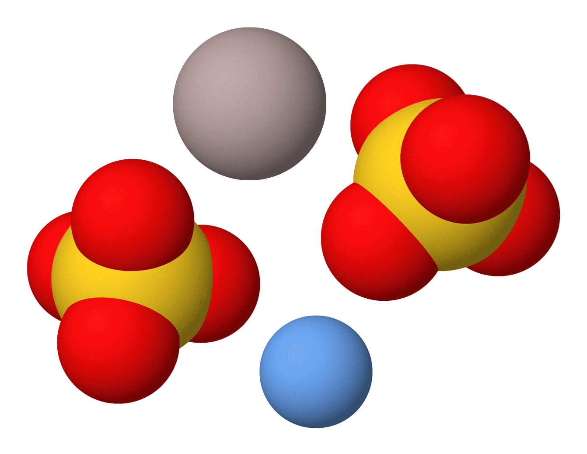

## $\ce{CaSO4}$ 

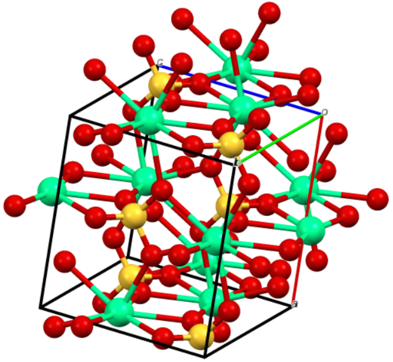

## $\ce{CuSO4}$ 

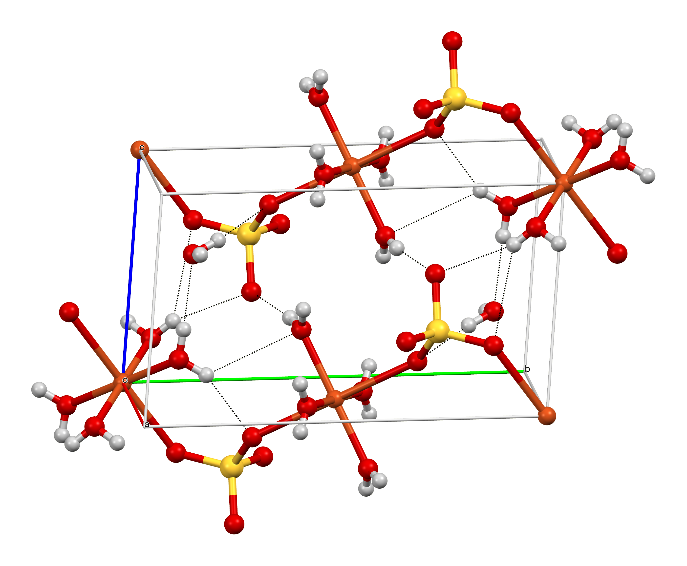

# $\ce{MnO^{−}4}$

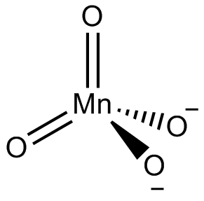

## $\ce{HMnO4}$

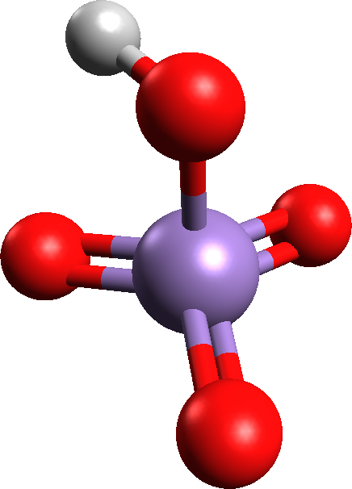

## $\ce{KMnO4}$

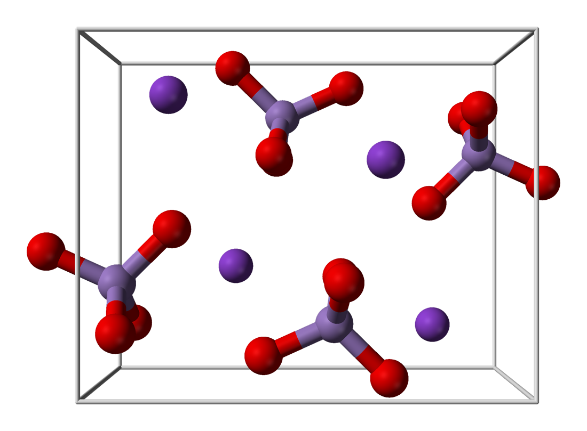
$$
\ce{2 MnO2 + 4 KOH + O2 -> 2 K2MnO4 + 2 H2O}
$$