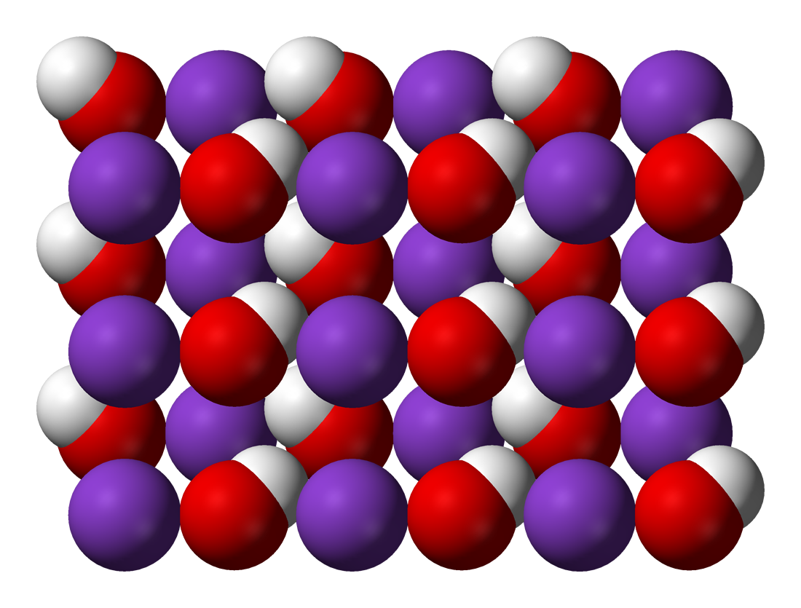

# Hydroxide

[TOC]

# $\ce{OH−}$

$\ce{OH−}$ consists of an oxygen and hydrogen atom held together by a single covalent bond, and carries a negative electric charge.

# $\ce{NaOH}$

$\ce{NaOH}$ is a white solid ionic compound consisting of sodium cations Na+ and hydroxide anions OH−.

# $\ce{AlOH}$

$\ce{AlOH}$ consists of aluminium in the +1 oxidation state paired with a single hydroxide.

# $\ce{KOH}$

# $\ce{Ca(OH)2}$

