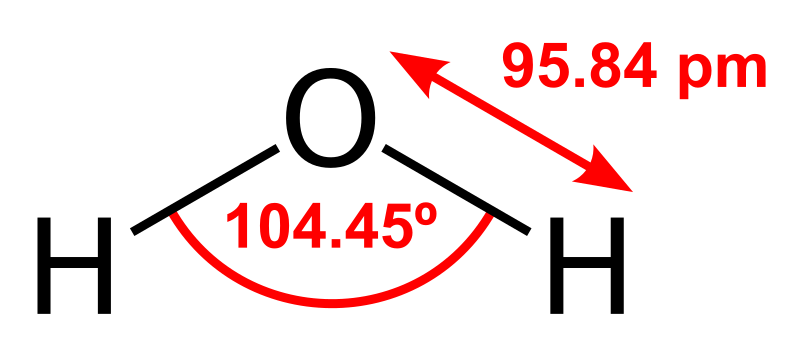
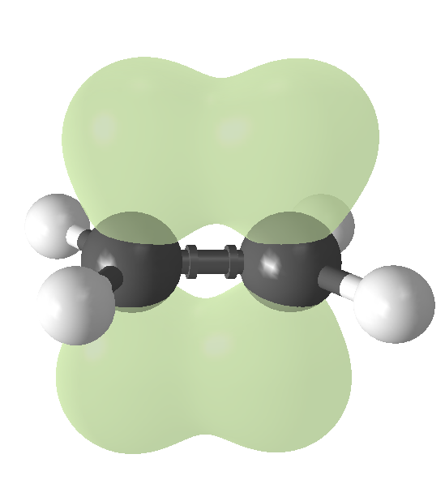
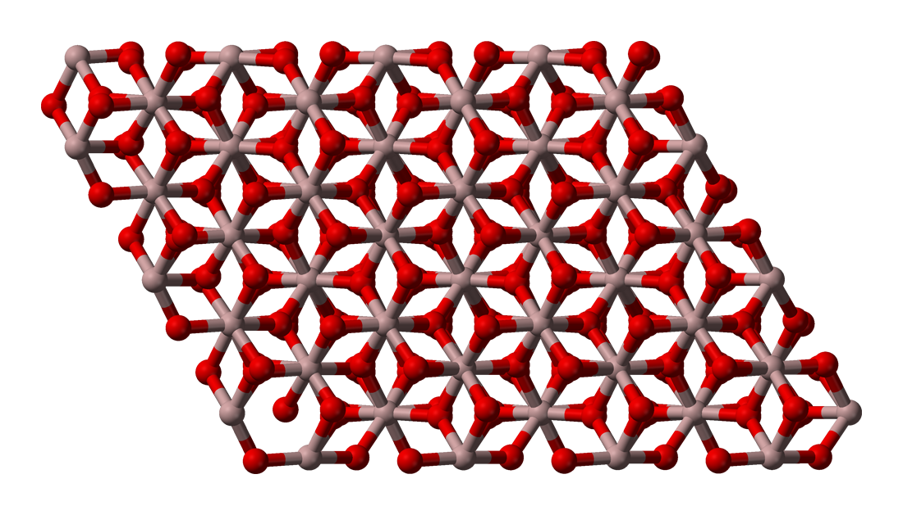
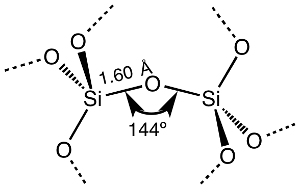
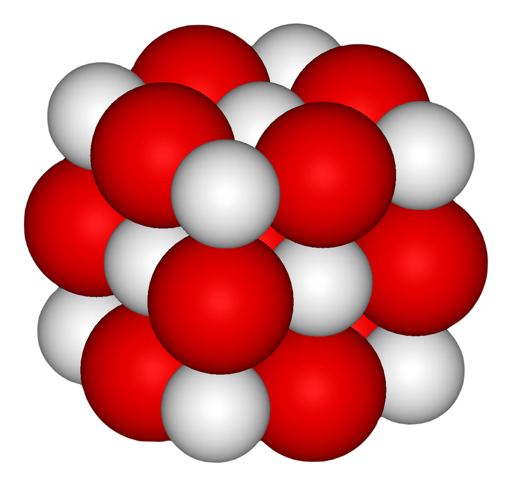
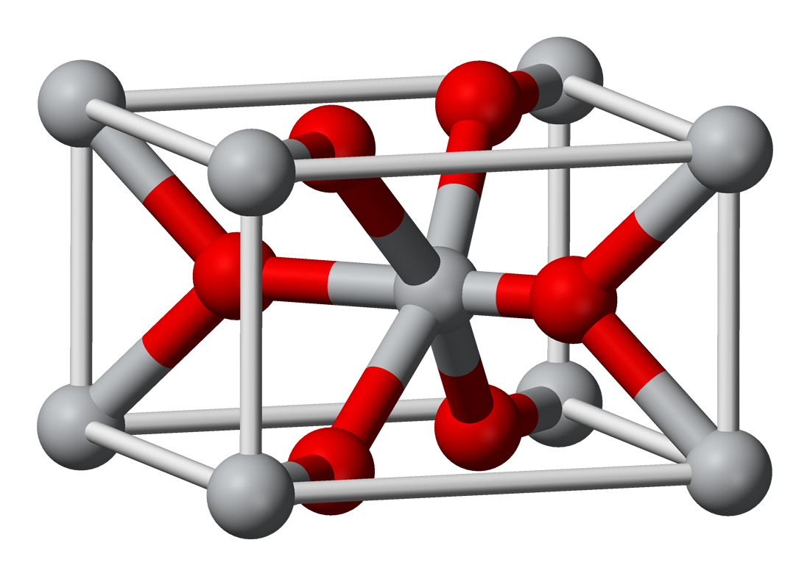
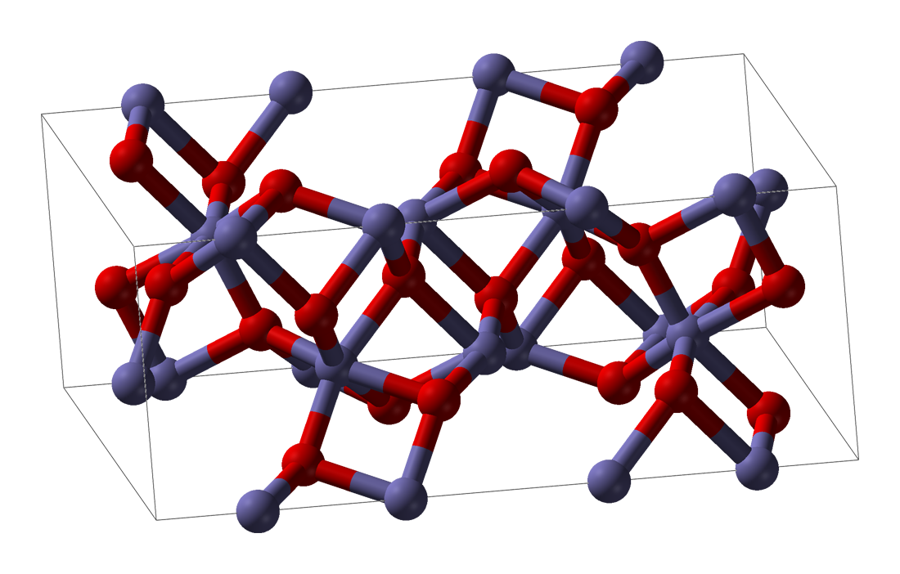
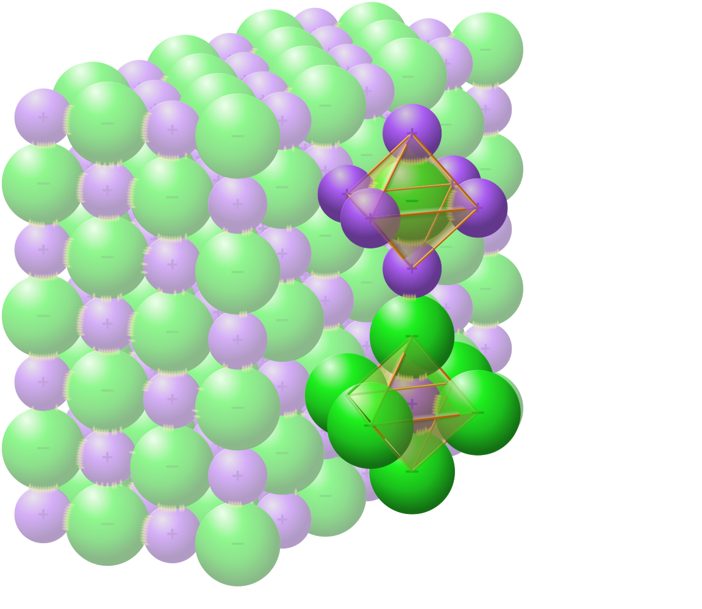

# $\ce{X_xY_y}$
[TOC]

# $\ce{H2O}$

$$
\ce{2 H2O <=> OH^- + H3O^+}
$$

# $\ce{C_xH_y}$

## $\ce{CH4}$

## $\ce{C_nH_{2n+2}}$

## $\ce{C2H4}$

## $\ce{C2H2}$

$$
\ce{H-C#C-H}
$$

## $\ce{C6H6}$

.svg)

# $\ce{NH3}$

$$
{\displaystyle {\ce {NH3.H2O->[{\triangle }]NH3\uparrow +H2O}}}
$$

$$
{\displaystyle {\ce {2NH4Cl{+}Ca(OH)2->2NH3\uparrow +CaCl2{+}2H2O}}}\\
$$

$$
{\displaystyle {\ce {N2 + 3H2 <=> 2NH3}}\qquad {\Delta H^{\circ }=-92.28\;{\ce {kJ}}}\ （{\Delta H_{298\mathrm {K} }^{\circ }=-46.14\;\mathrm {kJ/mol} }）}
$$

# $\ce{CO}$

# $\ce{CO2}$

# $\ce{N_{x}O_{y}}$

## $\ce{NO}$

## $\ce{NO2}$

# $\ce{Al2O3}$

# $\ce{SiO2}$

# $\ce{CaO}$

$$
{\displaystyle {\rm {CaO+H_{2}O\rightarrow Ca(OH)_{2}}}}
$$

# $\ce{MnO2}$

# $\ce{Fe2O3}$

$$
\displaystyle {\rm {2Al+Fe_{2}O_{3}{\xrightarrow {\Delta }}Al_{2}O_{3}+2Fe}}
$$

$$
{\displaystyle {\rm {2Fe_{2}O_{3}+3C{\xrightarrow {\Delta }}4Fe+3CO_{2}\uparrow }}}\\
{\displaystyle {\rm {Fe_{2}O_{3}+3CO{\xrightarrow {\Delta }}2Fe+3CO_{2}\uparrow }}}
$$

# $\ce{Fe3O4}$

$$
{\displaystyle {\ce {3Fe + 4H2O->Fe3O4 + 4H2}}}
$$

$$
\ce {3Fe(OH)2->Fe3O4 + H2 + 2 H2O}
$$

# $\ce{NaCl}$

面心立方晶格	立方晶系

