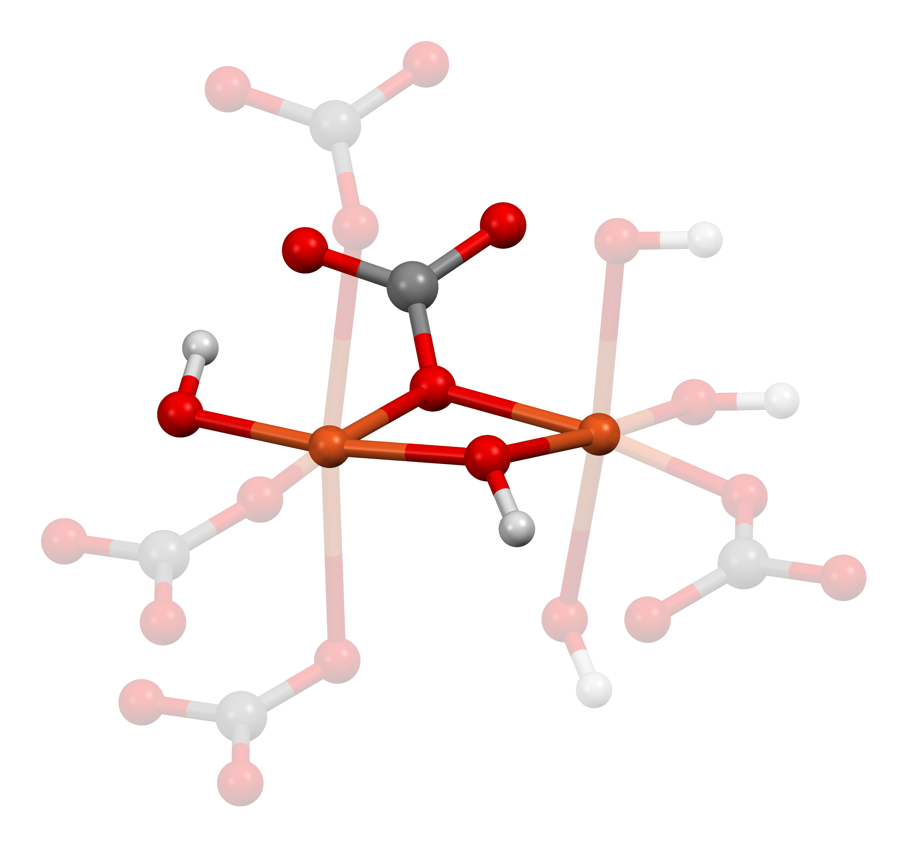
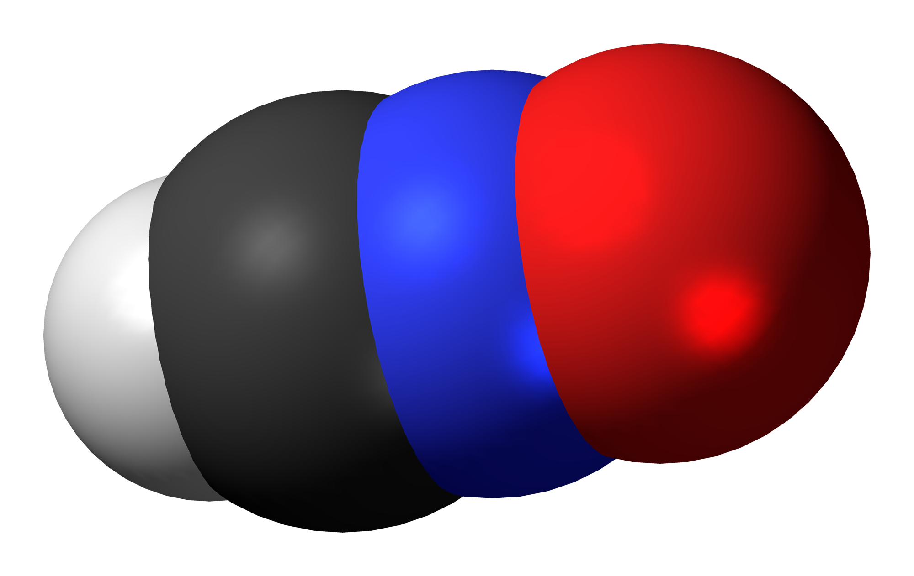
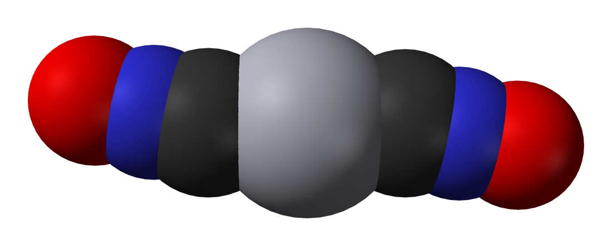

[TOC]

# $\ce{Cu2CO3(OH)2}$

$\ce{Cu2CO3(OH)2}$ is an ionic compound (a salt) consisting of the ions copper(II) $\ce{Cu}^{2+}$, carbonate $\ce{CO}^{2-}_{3}$, and hydroxide $\ce{OH−}$.

# $\ce{HCNO}$

$$
\ce{H-C≡N+-O-}
$$

# $\ce{HNCO}$

# $\ce{Hg(CNO)2}$

# $\ce{[SiO_x(OH)_{4−2x}]_n}$
