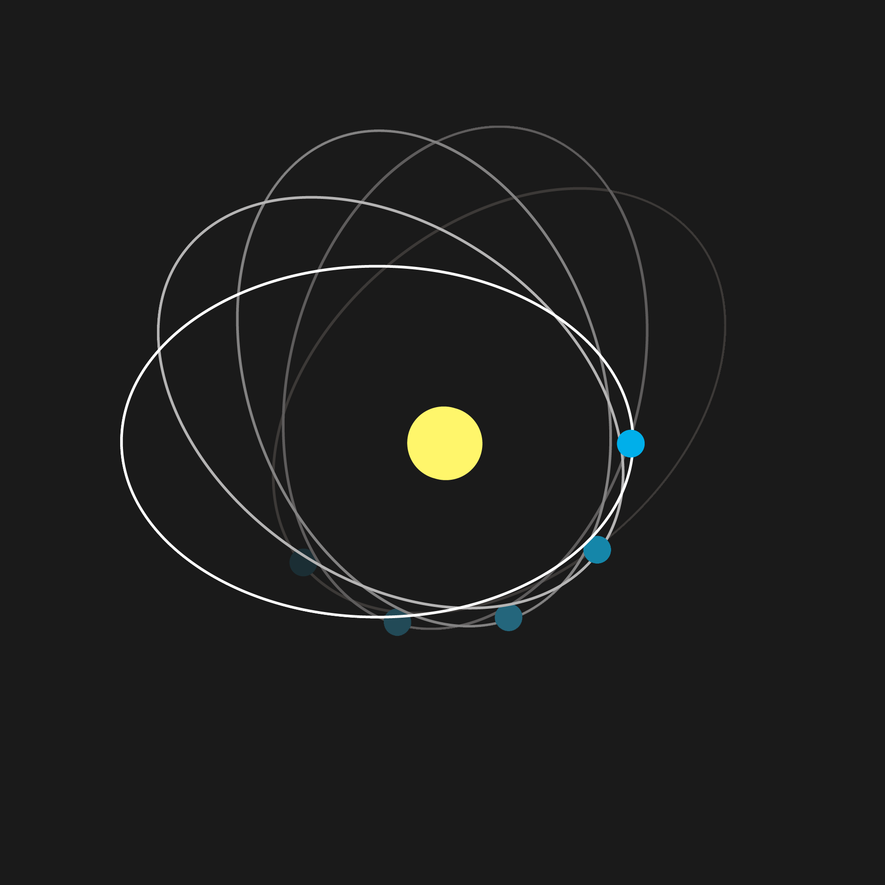
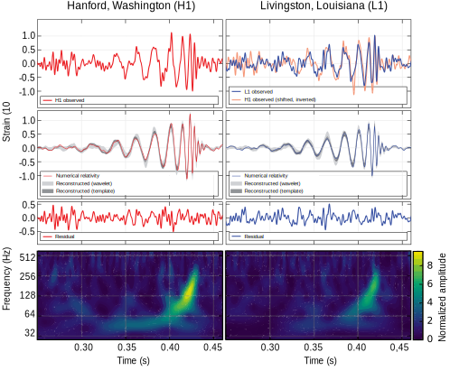

[TOC]

### Perihelion precession of Mercury

This anomalous rate of precession of the perihelion of Mercury's orbit was first recognized in 1859 as a problem in celestial mechanics, by Urbain Le Verrier. His re-analysis of available timed observations of transits of Mercury over the Sun's disk from 1697 to 1848 showed that the actual rate of the precession disagreed from that predicted from Newton's theory by 38″ (arcseconds) per tropical century (later re-estimated at 43″ by Simon Newcomb in 1882). Subsequently, Einstein's 1915 general theory accounted for Mercury's anomalous precession. In general relativity, this remaining precession, or change of orientation of the orbital ellipse within its orbital plane, is explained by gravitation being mediated by the curvature of spacetime. Einstein showed that general relativity agrees closely with the observed amount of perihelion shift. This was a powerful factor motivating the adoption of general relativity.

### LIGO: discovery of gravitational waves

On 11 February 2016, the **Laser Interferometer Gravitational-Wave Observatory** (LIGO) collaboration announced the first observation of gravitational waves, from a signal detected at 09:50:45 GMT on 14 September 2015 of two black holes with masses of 29 and 36 solar masses merging about 1.3 billion light-years away. During the final fraction of a second of the merger, it released more than 50 times the power of all the stars in the observable universe combined. The signal increased in frequency from 35 to 250 Hz over 10 cycles (5 orbits) as it rose in strength for a period of 0.2 second. The mass of the new merged black hole was 62 solar masses. Energy equivalent to three solar masses was emitted as gravitational waves. The signal was seen by both LIGO detectors in Livingston and Hanford, with a time difference of 7 milliseconds due to the angle between the two detectors and the source. 

