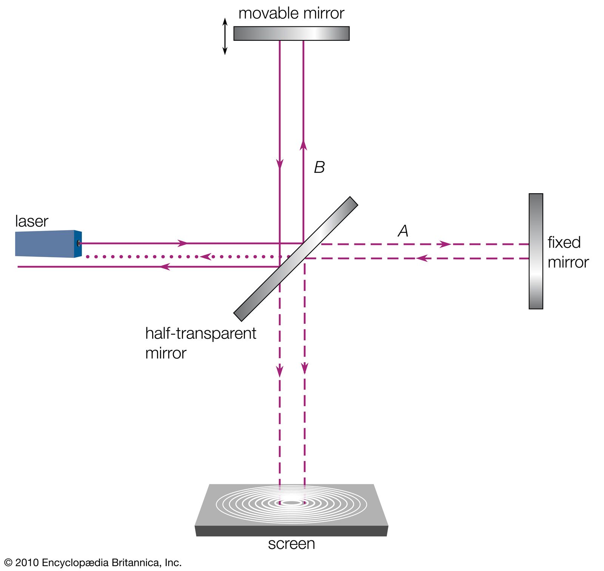

# Special Relativity

[TOC]

### Michelson-Morley interference experiment

1881年Michelson-Morley干涉实验, 表明光速与其传播方向无关. 而按经典力学,光应在地球速度同方向$(v+c)$,比反方向$(v-c)$更快一点. 因此, Galilean变换的绝对时间假设$(t=t')$错了, 不同参考系下时间流逝的速度不同.

