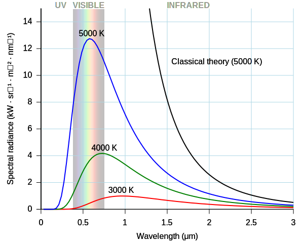
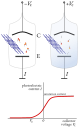

## Blackbody Radiation Intensity

### observed spectrum of black-body radiation

 Planck's law

$$
u_{\nu}(\nu, T)=\frac{8 \pi h \nu^{3}}{c^{3}} \frac{1}{\exp \left(\frac{\hbar \nu}{k_{\mathrm{B}} T}\right)-1}
$$

## Photoelectric Effect

### Einstein explanation

$$
K_{\max} = h(\nu - \nu_0)
$$