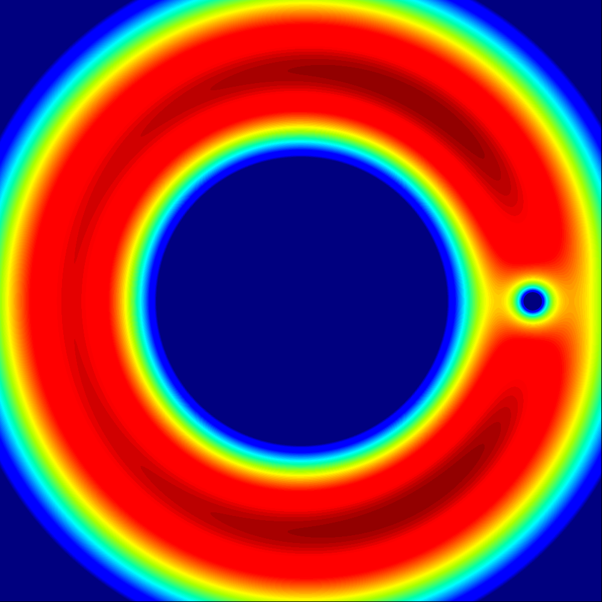

# 多体问题

[TOC]

## Two-body problem

一个质点并作为原点静止时, 另一个质点的轨迹方程如下所述。其中, 圆锥曲线的极坐标方程, $e$离心率, $p$半通径. 二体场景在惯性系中可以抽象为绕等效质心运动。
$$
\begin{align*}
  r &= \frac{p}{1 - e \sin(θ + θ_0)}  \\
  p &= \frac{L^2}{G M m^2}  \\
  e &= \sqrt{1 + 2 \frac{E}{m} \left(\frac{L}{G M m}\right)^2}
\end{align*}
$$
- Proof
  
  建立方程组。其中$L, E$是常量. $r, θ, v_r, v_θ$是变量. 3个方程4个变量.求出 $r-θ$ 关系式.
  $$
  \begin{align*}
    L &= m r v_θ  \tag{角动量守恒}  \\
    E &= \frac{1}{2} m (v_r^2 + v_θ^2) - G \frac{M m}{r}  \tag{能量守恒}  \\
    \frac{\mathrm d r}{\mathrm d θ} &= r \frac{v_r}{v_θ}  \tag{$v_r = \frac{\mathrm d r}{\mathrm d t}, v_θ = r \frac{\mathrm d θ}{\mathrm d t}$}
  \end{align*}
  $$
  解方程组
  $$
  \begin{align*}
  v_θ &= \frac{L}{m r}  \tag{独立$v_θ$}  \\
  v_r &= \sqrt{\frac{2 E}{m} + \frac{2 G M}{r} -\left(\frac{L}{m}\right)^2 \frac{1}{r^2}}  \tag{独立$v_r$}\\
  \Rightarrow\quad  \frac{\mathrm d r}{\mathrm d θ} &= r \frac{v_r}{v_θ}  \\
  &= r \frac{m r \sqrt{\frac{2 E}{m} + \frac{2 G M}{r} - \left(\frac{L}{m}\right)^2 \frac{1}{r^2}}}{L}  \tag{代入}
  \end{align*}
  $$
  $$
  \begin{align*}
  \Rightarrow\quad  \int \frac{\mathrm d r}{r^2 \sqrt{\frac{2 E}{m} + \frac{2 G M}{r} - \left(\frac{L}{m}\right)^2 \frac{1}{r^2}}} &= \int \frac{m}{L} \mathrm d θ  \tag{两边独立$r,θ$,并积分}  \\
  \Rightarrow\quad  - \int \frac{\mathrm d \left(\frac{1}{r}\right)}{\sqrt{\frac{2 E}{m} + 2 G M \frac{1}{r} - (\frac{L}{m})^2 \frac{1}{r^2}}} &= \frac{m}{L} θ + C_θ  \tag{换元}  \\
  \Rightarrow\quad  - \left(\frac{m}{L} \arcsin \frac{\left(\frac{L}{m}\right)^2 \frac{1}{r} - G M}{\sqrt{G^2 M^2 + \frac{2 E}{m} \left(\frac{L}{m}\right)^2 }} + C_r\right) &= \frac{m}{L} θ + C_θ  \tag{$\int \frac{\mathrm d x}{\sqrt{c+b x-a x^2}} = \frac{1}{\sqrt{a}} \arcsin \frac{2 a x-b}{\sqrt{b^2 + 4 a c}} + C$}  \\
  \Rightarrow\quad  - \left(\frac{1}{L_0} \arcsin \frac{L_0^2 \frac{1}{r} - G M}{\sqrt{G^2 M^2 + 2 E_0 L_0^2 }} + C_r\right) &= \frac{1}{L_0} θ + C_θ  \tag{$L_0 = \frac{L}{m}, E_0 = \frac{E}{m}$}
  \end{align*}
  $$
  
  $$
  \begin{align*}
    \Rightarrow\quad  r &= \frac{L_0^2}{\sqrt{G^2 M^2 + 2 E_0 L_0^2 } \sin(-θ + θ_0) + G M}  \\
    \Rightarrow\quad  r &= \frac{L_{00}^2 G M}{1 + \sqrt{1 + 2 E_0 L_{00}^2 } \sin(-θ + θ_0)}  \tag{$L_{00} = \frac{L_0}{G M} = \frac{L}{G M m}$}
  \end{align*}
  $$

### Lambert's Problem

是二体问题中的一类经典问题。它通常被描述为：给定初末位置和转移时间，求初末速度。其基本几何参数如图所示。

## Restricted three-body problem

两个大质量天体 $M_1, M_2$, 选择以质心为原点且使其相对静止的旋转参考系, 则势能有, 
$$
\begin{align*}
U &= -\frac{GM_1}{r_1} -\frac{GM_1}{r_2} - \frac{1}{2} \omega^2 r^2\\
\omega &= \sqrt{\frac{G(M_1+M_2)}{d^3}}\\
r_1 &= \sqrt{(x + \frac{M_2}{M_1+M_2}d)^2 + y^2}\\
r_2 &= \sqrt{(x - \frac{M_1}{M_1+M_2}d)^2 + y^2}
\end{align*}
$$

### Lagrange Points

Lagrange points are points of equilibrium for small-mass objects under the gravitational influence of two massive orbiting bodies. Mathematically, this involves the solution of the restricted three-body problem. 拉格朗日点的条件
$$
\nabla U = 0
$$

$$
\begin{align*}
L_1 &= \left(-\frac{M_2}{M_1 + M_2}d , 0\right)\\
L_2 &= \left(+\frac{M_1}{M_1 + M_2}d , 0\right)\\
L_3 &= \left(-\frac{M_1}{M_1 + M_2}d , 0\right)\\
L_4 &= \left(\frac{M_2}{M_1 + M_2}d, +\frac{\sqrt{3}}{2} d\right)\\
L_5 &= \left(\frac{M_2}{M_1 + M_2}d, -\frac{\sqrt{3}}{2} d\right)\\
\end{align*}
$$

- Proof
  $$
  \nabla U = \left( GM_1 \frac{x + \frac{M_2}{M_1 + M_2} d}{r_1^3} + GM_2 \frac{x - \frac{M_1}{M_1 + M_2} d}{r_2^3} - \omega^2 x, \; GM_1 \frac{y}{r_1^3} + GM_2 \frac{y}{r_2^3} - \omega^2 y \right)
  $$

